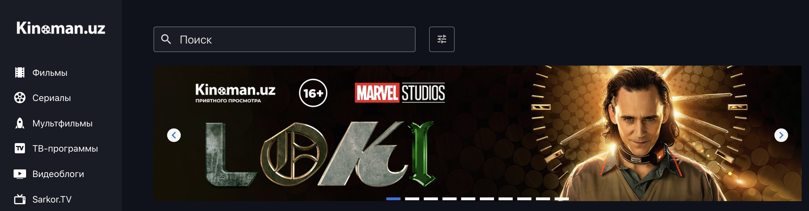
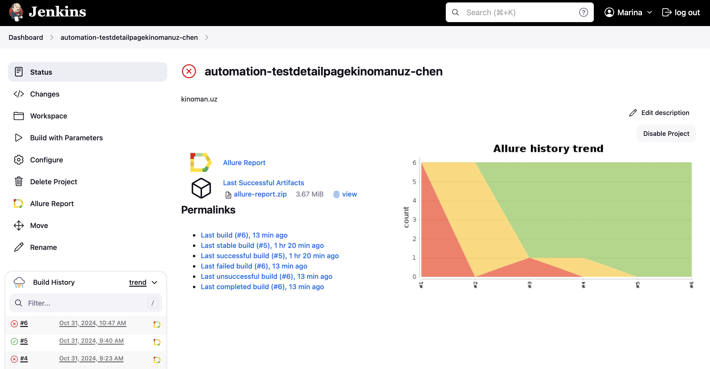
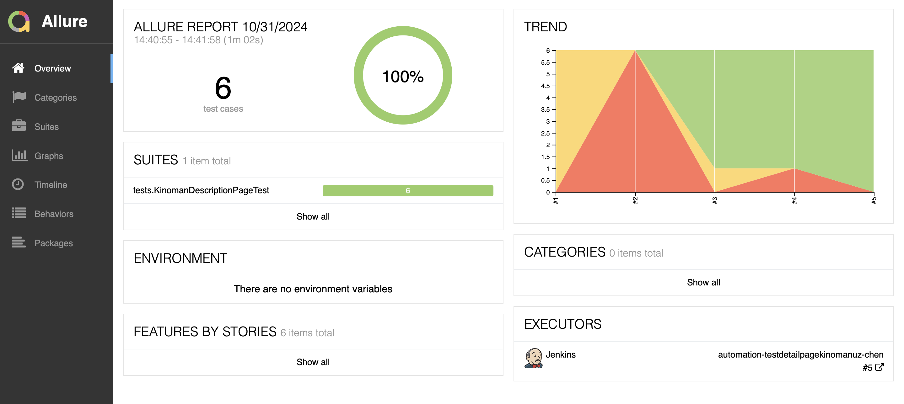
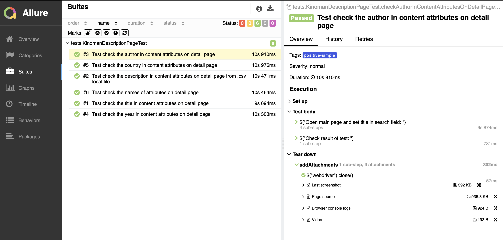
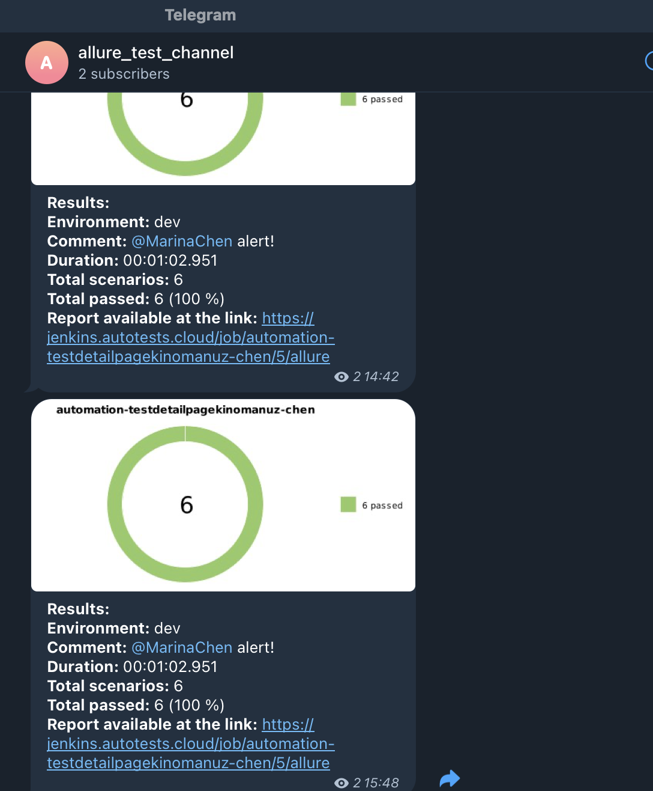
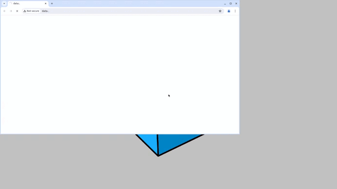

<h1>Test automation project for a detailed page for the site <a href="https://kinoman.uz">kinoman.uz</a></h1>

  

## ☑️ Content:

-  Technologies and tools
-  List of checks implemented in tests
-  Running tests (build in Jenkins) and from the terminal
-  Allure report
-  Notification in Telegram about test run results
-  Video example of passing tests

<a id="tools"></a>
## :ballot_box_with_check: Technologies and tools
<a href="https://gradle.org/"></a>
<a href="https://github.com/allure-framework"></a>
<a href="https://www.jenkins.io"></a>
<a href="https://selenide.org"></a>
<a href="https://web.telegram.org"></a>
<a href="https://junit.org/junit5/"></a>
<a href="https://aerokube.com/selenoid/"></a>

<a id="cases"></a>

## :ballot_box_with_check: Implemented checks:

- Availability of the Movie Title field on the detail page
- Presence of the Film Year field on the detail page
- Presence of the Film Director field on the detail page
- Presence of the Movie Description field on the detail page
- Presence of the Film Countries field on the detail page

##  Сборка в [Jenkins](https://jenkins.autotests.cloud/job/automation-testdetailpagekinomanuz-chen/)

<p align="center">  
  
</p>  
:ballot_box_with_check: Jenkins build options:

- authorization data in wb selenoid.autotests.cloud
- test launch type

## Command to run from terminal

Remote launch using Jenkins+Selinoid (login and password required):
```bash  
gradle clean demoqa_test -Dcredential=user1:1234
```

## </a>  <a name="Allure"></a>Allure Report	</a>

## Main report page

<p align="center">  
  
</p>  

## Тест-кейсы

<p align="center">  

</p>

____
## </a> Notification in Telegram using a bot
____
<p align="center">  
  
</p>

____
## </a> Examples of videos of performing tests on Selenoid
____
<p align="center">
   
</p>

